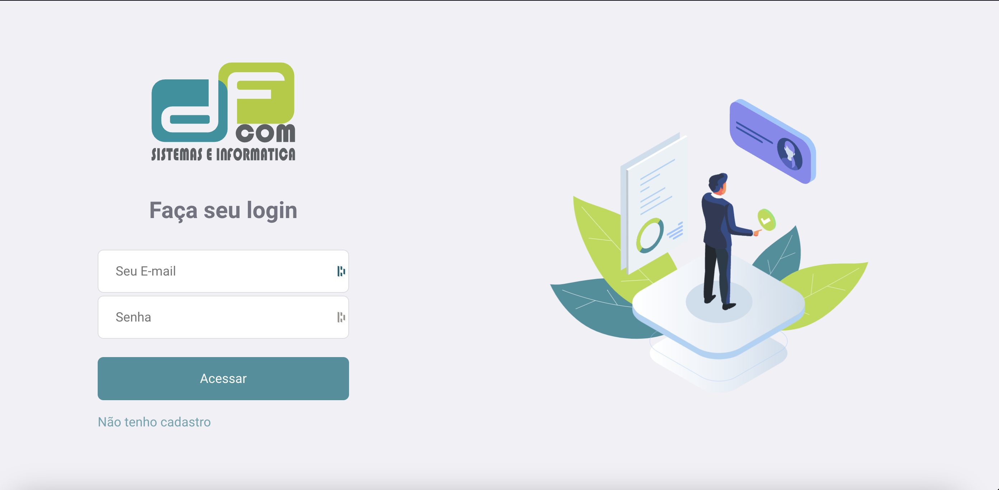

<p align="center">
     
</p>

# DFCOM Teste Técnico
<p>
  

  
  
  <a href="https://github.com/WallysonGalvao/rocketseat-gobarber/commits/master">
    
  </a>

  <a href="https://github.com/WallysonGalvao/rocketseat-gobarber/issues">
    
  </a>

  
</p>


## 🛠️ Tecnologias utilizadas
- NestJS
- Next.js
- Styled Components
- TypeScript

## 📚 Instalação
- Pré-requisitos
- Node + npm ou yarn

Passos para instalação
1. Clone este repositório:
```bash 
    git clone https://github.com/GabrielMouraJS/DFCom
```

2. Execute a aplicação em ambos os ambientes:
```bash 
    cd server
    yarn
    npx prisma migrate dev
    yarn start:dev

    cd ..
    cd frontend
    yarn
    yarn dev
```
   

3. Acesse o aplicativo no navegador em http://localhost:3000

## 🤝 Contribuindo
Sinta-se à vontade para abrir issues ou enviar pull requests com suas sugestões e melhorias. Adoraríamos receber sua ajuda!

## 📞 Contato
Se você tiver alguma dúvida, entre em contato com os desenvolvedores por e-mail: gabrielmourajs@gmail.com

## 🎯 Próximos passos
À medida que o projeto MindMinder evolui, planejamos implementar os seguintes recursos e melhorias:

1. **Containerizaçao com Docker e Docker-Compose**

2. **Gateway para conexão de múltiplos serviços utilizando Apollo Federation + GraphQL**: Integrar a arquitetura de microserviços usando Apollo Federation para facilitar a expansão e manutenção do aplicativo, permitindo a conexão de múltiplos serviços GraphQL.

Sinta-se à vontade para contribuir com essas melhorias ou sugerir novas ideias através de issues e pull requests no repositório do projeto.